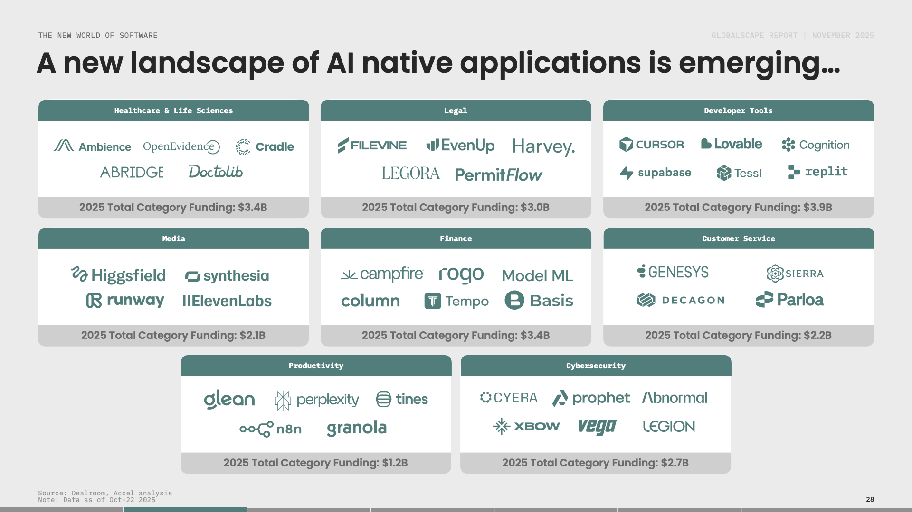
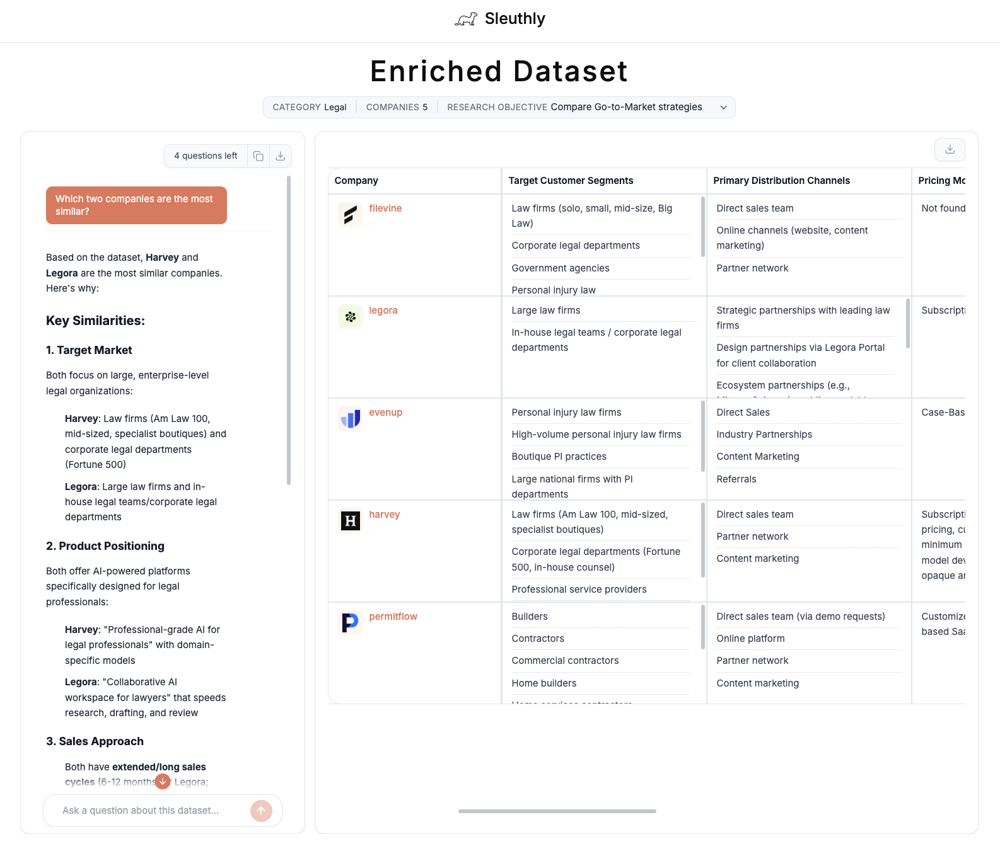

# AI Product Workflows

Scripts and workflows for building AI-native products. 
Production-tested in [Sleuthly](https://sleuthlyai.com/) — a tool that transforms 
static market maps into actionable product intelligence.

## What's included

### market-map-extractor
Extract structured company data from market map images using 
Claude's vision capabilities. [Details →](link to folder README)

### ai-browser-workflows  
Browser automation workflows for enriching company data.
[Details →](link to folder README)

## What's Coming

### Deep Research Agent
Autonomous research workflows that go beyond single-page extraction.

### End to End Enrichment Pipeline Example
A complete working example connecting all workflows together.

## Built with this
### Before: Static Market Map

### After: Sleuthly Enriched Dataset

Sleuthly transforms static market maps into actionable insights in three steps:
- Extract companies using Claude's vision capabilities
- Enrich company data with URLs, descriptions, and logos using Kernel Browser Agents
- Enable AI-powered research on the extracted data using parallel Research Agents

→ [Try Sleuthly](https://sleuthlyai.com/)
